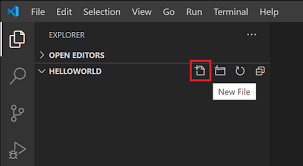

# Minicurso Introdução Ao Backend

# 📄 Aula 1

## 🎯 Objetivo da aula

- Entender o básico de backend com JavaScript
- Criar servidor com rotas
- Trabalhar com HTTP na prática

---

# ⏱️ Introdução

> Prática e teoria juntos!
> 

---

# ⏱️ JavaScript + Node

### 🧠 A Evolução da Linguagem

O **JavaScript** nasceu com um propósito dar vida e interatividade às páginas web dentro dos navegadores. (Client-Side)

Com **Node.js (Runtime)**. Um **ambiente de execução** que permitiu que o JavaScript passasse a rodar diretamente no servidor.

---

### 💡 Por que escolher essa stack para o Backend?

Existem três pilares que tornam essa combinação imbatível para o mercado atual:

- **Linguagem Universal (Full Stack Real):**
    - Mesma lógica, sintaxe, bibliotecas
    - Reduz curva de aprendizado
    - Facilita comunicação
- **Velocidade e Escalabilidade:**
    - Construído sobre V8 (Google Chrome)
    - O Node.js possui arquitetura baseada em eventos (Event Loop)
- **Ecossistema Gigantesco:**
    - **NPM** (Node Package Manager), você tem acesso ao maior registro de software do mundo.
    - Facilita abstração.

---

## ⚠️ Comparação rápida com outras linguagens

- Java
    - Mais estruturado e verboso
    - Forte tipagem e organização
- Python
    - Simples e fácil de escrever
    - Pode ter limitações de performance em alguns cenários
- Node.js
    - Leve e eficiente
    - Muito utilizado para APIs e aplicações web
- TS
    - Superset do JavaScript que adiciona tipagem estática
    - Ajuda a evitar erros em tempo de desenvolvimento
    - Melhora organização e manutenção do código
    - Muito usado em projetos grandes e escaláveis

> **Ideia central:** cada tecnologia tem seu foco — estrutura (Java), simplicidade (Python), leveza e APIs (Node.js) e tipagem estática (TypeScript).
> 

---

# ⏱️ Bibliotecas + Express

### Uso de bibliotecas no Node.js — Resumo curto

- Node.js puro consegue criar servidor, mas exige muito código manual
- Tarefas básicas (rotas, requisições) ficam mais complexas
- Isso dificulta manutenção e aumenta erros
- Bibliotecas simplificam tudo isso
- Exemplo: Express.js facilita criar servidores rapidamente

> **Ideia central:** Node puro é poderoso, mas bibliotecas tornam o desenvolvimento prático e rápido
> 

---

## Introdução ao Express.js

### Resumo curto

- Express.js simplifica a criação de APIs
- Reduz a quantidade de código necessário
- Resolve problemas comuns (rotas, requisições, respostas)
- Torna o desenvolvimento mais rápido e organizado

> **Ideia central:** Express abstrai complexidade e acelera o desenvolvimento de APIs
> 

---

# ⏱️ HTTP Methods

> HTTP define como cliente e servidor se comunicam, incluindo métodos (ações), formatos de requisição/resposta e códigos de status.
> 

## Métodos:

- GET → buscar
- POST → criar
- PUT → atualizar
- DELETE → remover

---

## 🧠 Conceitos

- Rota = caminho da API
- `req` = requisição
- `res` = resposta

---

# 🚀 Começando do Zero: Preparando o Ambiente

Antes de mergulharmos no código, vamos preparar nossa pasta de trabalho de um jeito profissional. Siga estes passos simples:

### ⚡ Passo 1: Abrindo o Terminal
Pressione as teclas **`Windows + R`** no seu teclado. Na pequena janela que abrir, digite **`cmd`** e aperte **Enter**.

### 📂 Passo 2: Localização Dinâmica
Para entrar na sua pasta de Documentos de forma dinâmica (compatível com **Windows 10** e **Windows 11**), utilize o comando:

```cmd
cd %userprofile%\Documents
```

### 🛠️ Passo 3: Criando seu Projeto
Agora, vamos criar uma nova pasta para o nosso curso e entrar nela:

```cmd
mkdir meu-projeto-js
cd meu-projeto-js
```

### 💻 Passo 4: Abrindo o VS Code
Com tudo pronto, digite o comando mágico para abrir o VS Code já dentro da pasta:

```cmd
code .
```

## 🖥️ Abrindo o Terminal

Para executar o seu código, você precisará abrir o terminal integrado do VS Code. Confira os métodos abaixo:

### ⚡ 1. Atalho de Teclado
Pressione estas teclas simultaneamente para abrir ou fechar o terminal instantaneamente:

> **`Ctrl`** + **`` ` ``**  *(tecla crase)*

### 🖱️ 2. Menu Superior / Top Menu
Se preferir usar o mouse, siga este caminho no menu do topo:

> **Terminal** ➔ **New Terminal** *(Novo Terminal)*

---

## 🛠️ Preparação Final

Antes de começarmos, precisamos garantir que seu ambiente está pronto:

### 🟢 1. Instalar o Node.js
O Node.js é o "motor" que permite executar JavaScript no seu computador.
- **Download:** Baixe a versão **LTS** no site oficial: [nodejs.org](https://nodejs.org/)
- **⚠️ Atenção:** Após concluir a instalação, **reinicie seu computador**. Isso garante que o terminal reconheça o comando `node`.

### 📝 2. Criando o arquivo `app.js`
Agora, vamos criar o arquivo onde escreveremos nosso primeiro código:
1. No VS Code, procure pelo ícone de **Novo Arquivo** (uma folhinha com um sinal de `+`) no menu lateral esquerdo.



2. Digite o nome **`app.js`** e aperte **Enter**.

---

### 🧪 Na Prática: Um único comando…

Executar **`node app.js`** ativa o motor V8 com I/O não-bloqueante, permitindo que a aplicação processe múltiplas requisições de forma assíncrona e eficiente.

> **Resumo:** JavaScript no navegador é interatividade. JavaScript com Node.js é poder de processamento.
> 

## 🧪 Código (Hello World)

```jsx
console.log("Hello World");
```

Rodar:

```bash
node app.js
```

---

## Instalação

```bash
npm init -y
npm install express
```

> **Obs:** o `-y` serve para agilizar a criação do projeto sem configuração manual
> 

---

# ⏱️ Meu primeiro servidor

## 🧪 Código

```jsx
const express = require("express");

const app = express();

app.get("/", (req, res) => {
  res.send("API rodando 🚀");
});

app.get("/user", (req, res) => {
  res.json({ name: "Theus", age: 20 });
});

app.listen(3000, () => {
  console.log("Servidor rodando na porta 3000");
});
```
> app.metodo(rota, função)
>

---

## 🧪 Código

```jsx
// Define uma rota POST para criar um usuário
app.post("/user", (req, res) => {
  res.send("Usuário criado");
});
```

### 🔍 Entendendo a Sintaxe: `app.metodo(rota, função)`

Toda vez que você cria uma funcionalidade no Express, você segue esse padrão. Vamos ver o que cada parte faz:

1.  **`app`**: É a variável que representa o seu servidor (a instância do Express).
2.  **`.post` (o método)**: Define o tipo de ação. No exemplo acima, usamos **POST** para indicar que estamos "enviando" ou "criando" algo.
3.  **`"/user"` (a rota)**: É o endereço que será acessado (ex: `seusite.com/user`).
4.  **`(req, res) => { ... }` (a função)**: É o que o servidor faz quando alguém acessa a rota.
    *   **`req` (Requisição)**: Tudo o que o usuário enviou para você (dados, senha, etc).
    *   **`res` (Resposta)**: O que você devolve para o usuário (um texto, um arquivo, um JSON).

---

# 🏁 Fechamento & Próximos Passos

Parabéns por concluir esta aula! Agora você já entende a base de como o Node.js e o Express funcionam. Para continuar sua jornada, explore os recursos abaixo:

### 🎥 Tutoriais em Vídeo (Passo a Passo)
*   **🛠️ Configuração Inicial:**
    *   [Como instalar o Node.js](https://youtu.be/VYo7hV7ua0c)
    *   [Como instalar o VS Code](https://youtu.be/XFb97QhzDWg)
*   **🚀 Prática e Projetos:**
    *   [Seu Primeiro Projeto no VS Code](https://youtu.be/lNtN7WuFtSQ) — *(🇺🇸 Vídeo em Inglês, mas muito didático. Ative as legendas!)*
    *   [O Essencial do Express.js](https://youtu.be/LU_UcXlv9yo) — *(Vídeo explicando o básico na prática)*

### 📖 Documentação e Pesquisa
*   🌐 **Site Oficial:** [Documentação do Express.js](https://expressjs.com/)
*   🔍 **Dica de Estudo:** Se você aprende melhor vendo a construção de algo do zero, pesquise no YouTube por: *"Como criar o primeiro projeto básico em express.js"*.

---

> [!IMPORTANT]
> **A prática é o segredo!** Não pare por aqui: tente criar novas rotas, experimente diferentes respostas em JSON e brinque com os parâmetros que aprendemos. 🚀